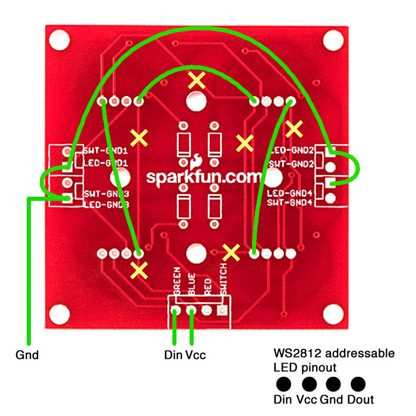

# Assembling the button board
The button board consists of 4 main parts:
* Spark Photon
* Sparkfun-branded 2x2 button pad PCB with 4 WS8212 RGB LEDs
* Rubbery 2x2 button pad buttons
* 3D printed case

## Printing the case
If you've got a 3D printer - great! If not, anything that can fit the components and hold the button board in place will work too. I used a Pepero box with X-acto cutouts as a prototype.

The case comes in two STL files:
 * [light-switch-case-v3.stl](stl/light-switch-case-v3.stl) which contains the case and a small lock arm to keep the Photon snug and in-place
 * [light-switch-top.stl](stl/light-switch-top.stl) which is just the top plate that goes over the button pad

Print settings used for both files:
* PLA (200 °C extruder / 60 °C bedplate)
* 0.2mm resolution
* 30% infill (doesn't really matter since the design is all "walls")
* No supports/rafts

## Soldering the PCB
Unfortunately the [Sparkfun 2x2 button PCB](https://www.sparkfun.com/products/9277) doesn't support individually addressable LEDs and instead supports only the analog LEDs that have a pins for R, G, B and ground. I modified the PCB by scratching out PCB traces and adding additional connections to support the WS8212 addressable LEDs.

Yellow X's are traces that need to be disconnected by scratching out the underlying metal trace. Use a multimeter to double check that there's no connectivity. Green lines represent new connections that need to be soldered together. 

Only three connections to the Photon board from the PCB are required now: Din (formerly "Green" pin), Vcc (formerly "Blue" pin), and Ground (still "LED-Ground" pin).

## Final assembly
